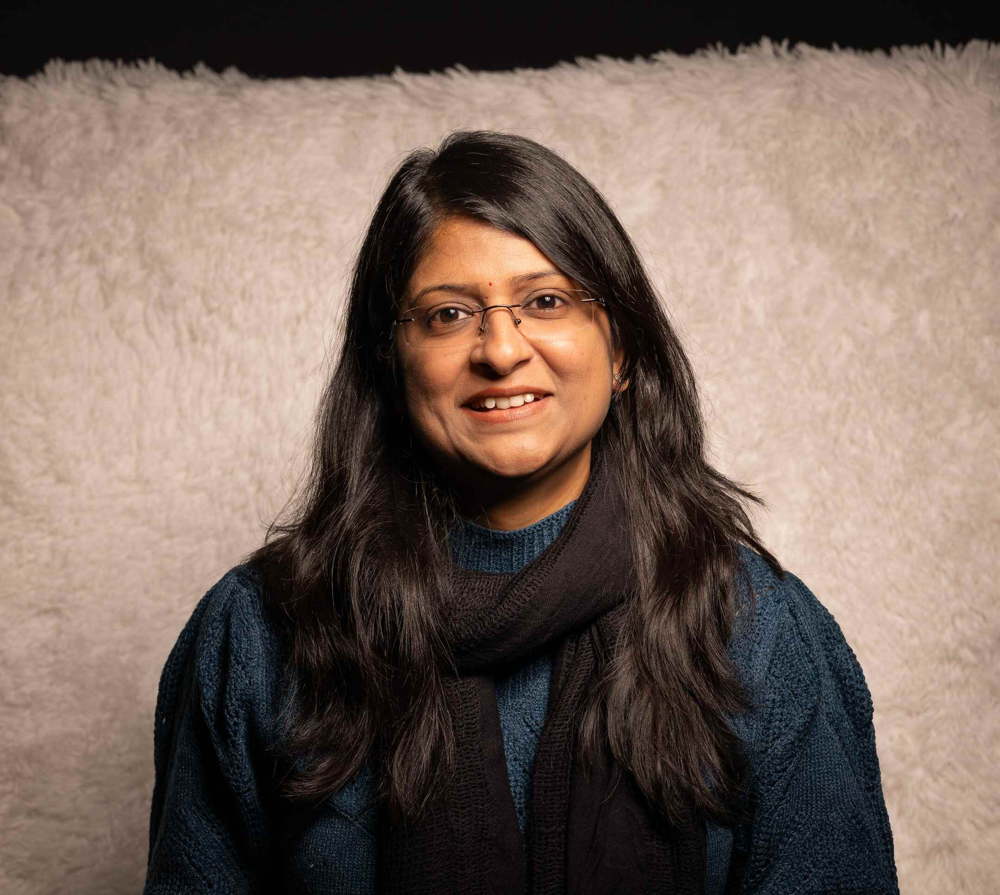

<p align="center">
  
</p>

<h2 align="center" style="color:#2E4053;">👋 Hello, I’m Praveena Pentakota (PP) </h2>

<h1 align="center" style="color:#1F618D;">
  PMP® Project Manager • R&D & QC • Lab Ops • CDMO (Contract Development and Manufacturing) 
</h1>

<h4 align="center">
  <font color="blue">
    <em>From Pipettes to Projects : Blending Scientific Rigor with Strategic Delivery</em>
  </font>
</h4>

---

<h3 style="color:#2874A6;">
  
  🌟 Precision Meets Project Management
</h3>

- **PMP®-certified** project manager & Biopharmaceutical research associate  
- **9 years'** hybrid experience in biopharma project management and lab R&D**
- Delivered 30+ global biopharma projects (>$2M) in CDMO & research settings   
- Hands-on **Bioanalytical testing** of mAbs & mRNA in **GMP environments**
- **Actionable insights** with **Power BI**, **JIRA**, **Smartsheet**   
- Driving **budgets**, **timelines**, & **compliance**
- Cross-functional **collaboration** with scientists, vendors, and global stakeholders

---

<h3 style="color:#239B56;">
  
  🚀 How I Solve Problems
</h3>

| 🔧 PM Skills                  | 💡 How I Add Value                          |
|---------------------------------|---------------------------------------------|
| **Scheduling & Budgeting** | Solved shifting project demands using risk logs, and earned value metrics - keeping delivery on track and preventing budget overruns |
| **Digital PM Tools**             | Boosted project efficiency by completing ~9 additional monthly tasks through Smartsheet, JIRA & SharePoint - enabling real-time collaboration and streamlined documentation |
| **Power BI**                     | Accelerated decision-making by 5 days on average with KPI dashboards that highlighted variances in real-time |
| **R&D, QC & Lab Operations**     | Executed 2000+ sample analyses (mAbs, mRNA), developing, validating, and transferring 10+ methods to QC - ensuring SOP compliance and audit-ready records |

### 🧪 Technical Lab Skills

| 🧪 Technical Skills              | 💡 How I Add Value                          |
|---------------------------------|---------------------------------------------|
| **HPLC, Capillary Electrophoresis, Gel Electrophoresis** | Analyzed **2000+ process samples** from upstream/downstream operations, delivering audit-ready data that supported engineering and GMP batch decisions |
| **qPCR & ELISA**                 | Quantified gene expression and protein levels with high sensitivity, ensuring reliable product characterization |
| **Method Validation & Transfer** | Developed, validated, and transferred **10+ bioanalytical methods** to QC, ensuring SOP compliance and regulatory readiness |
| **Bioanalytical R&D Support**    | Partnered with process development teams by providing rapid turnaround of data, enabling informed decisions in upstream & downstream optimization |
| **Immunohistochemistry (IHC)**   | Conducted IHC in *Drosophila* to support **neuroplasticity studies**, generating reproducible staining and imaging data for research publications |
---

<h3 style="color:#D35400;">
  
  🌱 Growth & Impact Highlights
</h3>

- **Delivered MVP 1 week early** - by leading *Scrum* sprint cycles across **40+ user stories** in JIRA for a web development project for a Calgary-based startup.  
- **Reduced reporting time by ~5 days** - by centralizing cost, schedule & productivity KPIs in **Power BI**.  
- Enhanced compliance accuracy across global client projects, reducing documentation errors by 15% and ensuring **ALCOA** adherence.   
- **Expanded medical-equipment access** - by coordinating logistics as a volunteer with the *Canadian Red Cross*.  
- **Increased webinar attendance by 40%** - by managing communications and coordinating with cross-functional teams for *PMI Lakeshore Ontario Chapter* as Communications Project Manager volunteer.

---

<h3 style="color:#8E44AD;">
  
  🧪 Featured Projects
</h3>

| Project | Description | Link |
|---------|-------------|------|
| **Project Controls Dashboard** | Real-time EVM metrics (EV, SV%, CV%) in Power BI | [Watch Demo](https://www.youtube.com/watch?v=mmmx_nv9FY8&t=10s) |
| **Project Prioritization Tool** | AI-driven ranking via Lovable & Claude | [View Tool](https://claude.ai/public/artifacts/735d9f82-efdf-4826-a18f-b0fee6685fe1) |
| **Hospital Readmission Prediction** | DataRobot model to predict readmissions & enable proactive care | [Open Project](https://claude.ai/public/artifacts/711b02f8-ef10-4434-bf96-d92afdf83250) |
---

<h3 style="color:#117A65;">🤝 Let's Connect</h3>

[](https://www.linkedin.com/in/praveenapmp/)  
[](mailto:praveena7p@gmail.com)  
📞 +1 (587) 284 6124
```


